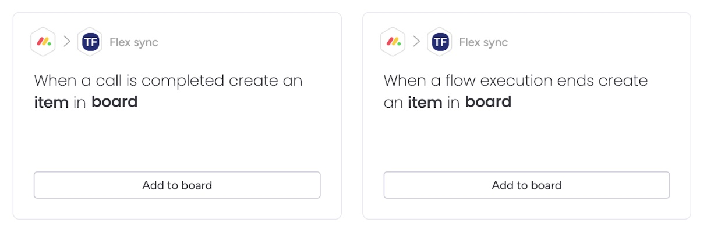
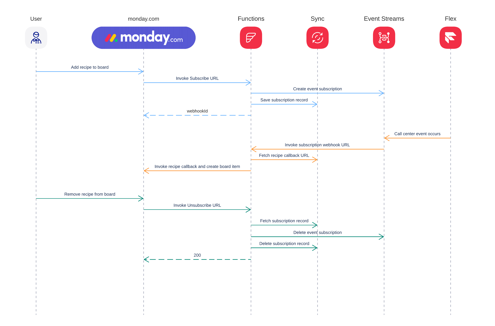

# Flex Custom Trigger

This folder contains a set of [Twilio Functions](https://www.twilio.com/docs/serverless/functions-assets/functions) for implementing monday.com recipes for sending call logs and IVR execution logs from Twilio to a monday.com board.

## Demo

  

## Design

  

## Setup

   1. Install the dependencies by running `npm install`.
   2. Install the [Twilio CLI](https://www.twilio.com/docs/twilio-cli/quickstart) by running `brew tap twilio/brew && brew install twilio`
   3. Head to the Twilio Console and create two Sync services, one for each recipe.
   4. Rename `.env.example` to `.env` and edit the variables as follows:
        - `ACCOUNT_SID=<YOUR_TWILIO_ACCOUNT_SID>`
        - `AUTH_TOKEN=<YOUR_TWILIO_AUTH_TOKEN>`
        - `MONDAY_SIGNING_SECRET=<MONDAY_SIGNING_SECRET>`
        - `IVR_SYNC_SERVICE_SID=<YOUR_IVR_SYNC_SERVICE_SID>`
        - `CALLS_SYNC_SERVICE_SID=<YOUR_CALLS_SYNC_SERVICE_SID>`   
   5. Deploy the functions by running `twilio serverless:deploy`. 
   6. Go to Monday.com and create an app with an Integration feature following the instructions [here](https://developer.monday.com/apps/docs/manage). 
   7. Set up the call log recipe, as follows:
       - Create a field type for call log records, and configure it as follows:
          - *Name*: `Call summary event`
          - *Default field key*: `sid`.
          - *Type*: `Dynamic Mapping`
          - *Field Definition URL*: `<FUNCTION_URL>/calls/fields` from step 5.
       - Create a trigger under Workflow Blocks, and configure it as follows:
          - *Name*: `Call completed`
          - *Output Fields*: `Call summary event`.
          - *Sentence*: `When a call is completed`
          - *Subscribe URL*: `<FUNCTION_URL>/calls/subscribe` from step 5.
          - *Unsubscribe URL*: `<FUNCTION_URL>/calls/unsubscribe` from step 5.
       - Create a recipe as follows:
          - *Trigger*: `Call completed`
          - *Action*: `create item in board`.
  8. Set up the IVR execution log recipe, as follows:
       - Create a field type for IVR execution log records, and configure it as follows:
          - *Name*: `Flow execution event`
          - *Default field key*: `sid`.
          - *Type*: `Dynamic Mapping`
          - *Field Definition URL*: `<FUNCTION_URL>/ivr/fields` from step 5.
       - Create a trigger under Workflow Blocks, and configure it as follows:
          - *Name*: `Flex Execution ended`
          - *Output Fields*: `Flow execution event`.
          - *Sentence*: `When a flow execution ends`
          - *Subscribe URL*: `<FUNCTION_URL>/ivr/subscribe` from step 5.
          - *Unsubscribe URL*: `<FUNCTION_URL>/ivr/unsubscribe` from step 5.
       - Create a recipe as follows:
          - *Trigger*: `Flex Execution ended`
          - *Action*: `create item in board`.
  9. That's it! Now you can add the recipes to your board(s).

## Maintainer

Thanks for reading this far!
If you have any questions, do not hesitate to reach out at `hello@slintab.dev`