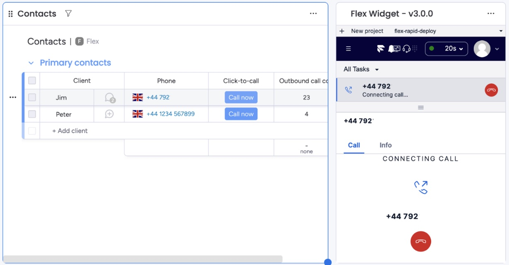
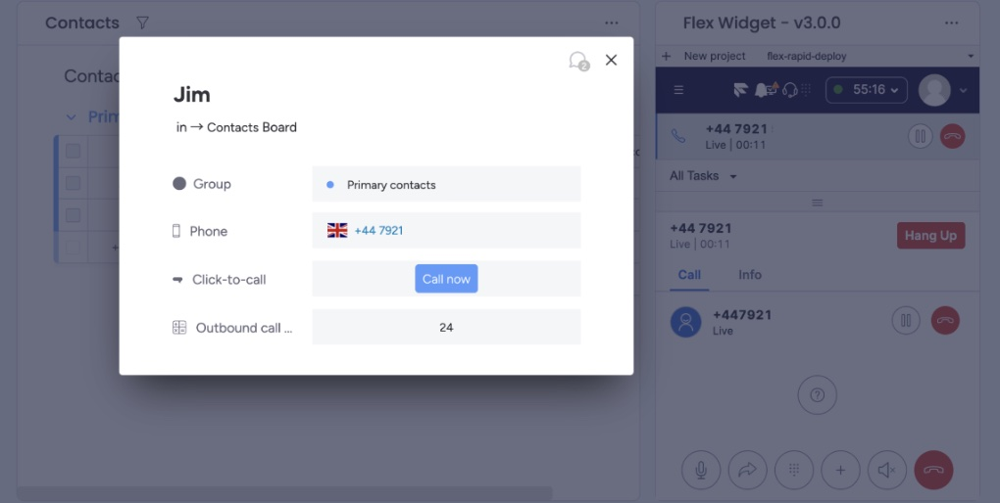

# Flex Widget Plugin

This Twilio Flex Plugin makes it easy to embed [Twilio Flex] within monday.com CRM as a dashboard widget. 

It also enables two common contact-center features:
- click-to-call to enable agents to place outbound calls by clicking on a contact in the CRM
- screen-pop to display contact records automatically for incoming calls.

## Demo

  
   

## Setup

Make sure you have [Node.js](https://nodejs.org) as well as [`npm`](https://npmjs.com). We support Node >= 10.12 (and recommend the _even_ versions of Node). 

   1. Install the dependencies by running `npm install`.
   2. Install the [Twilio CLI](https://www.twilio.com/docs/twilio-cli/quickstart) by running `brew tap twilio/brew && brew install twilio`
   3. Install the [Flex Plugin extension](https://github.com/twilio-labs/plugin-flex/tree/v1-beta) for the Twilio CLI `twilio plugins:install @twilio-labs/plugin-flex`.
   4. Head to [monday.com](monday.com) and set up a new board (or use an existing one), and add two columns:
        - a column of type *Phones* for storing phone numbers
        - a column of type *Button* for click-to-call.
   5. Create a monday.com add with a Dashboard widget feature following the instructions [here](https://developer.monday.com/apps/docs/manage). Set the View URL for the widget to `https://flex.twilio.com/agent-desktop`. Then add the new widget to the board from step 4.
   6. Head to the Twilio Console and under *Flex > Manage > General settings > Embed Flex as an iframe* add the URL of your monday.com instance to the list of Allowed URLs.
   7. Open the `src/config.ts` file and edit the variables as follows:
        - `BOARD_ID` - ID of the monday.com board in which the Flex widget is to be displayed.
        - `PHONE_NUMBER_COLUMN_ID` - ID of Phones column from step 4.
        - `CTC_COLUMN_ID` - ID of Button column from step 4.
   8. Deploy and enable the plugin by running `twilio flex:plugins:deploy` and `twilio flex:plugins:release`. 

That's it! You should now have Flex embedded in monday.com!

## Maintainer

Thanks for reading this far!
If you have any questions, do not hesitate to reach out at `hello@slintab.dev`